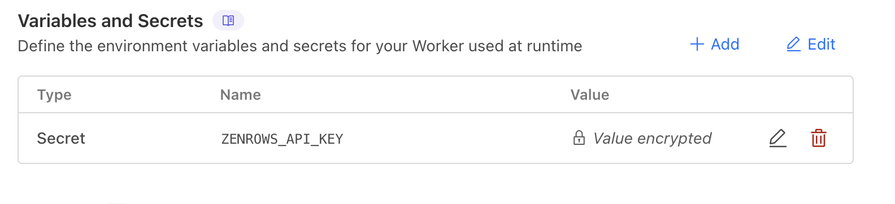

## Setup

```
npm install
```

## Deploy to your account on CloudFlare

```
npm run deploy
```

Ensure, by going to https://dash.cloudflare.com and navigating to your worker's settings page, that you have a secret called `ZENROWS_API_KEY`
set to a valid key.



## After deploy

Go to your worker URL in cloudflare, suffixed with /test. You should see
the same error that I am seeing. At least with our account's API key.

## Local dev

Have a `.dev.vars` file with the following format:

```ini
ZENROWS_API_KEY=the-api-key
```

```
npm run dev
```

Go to `http://localhost:8787/test`. You will not see the issue.

